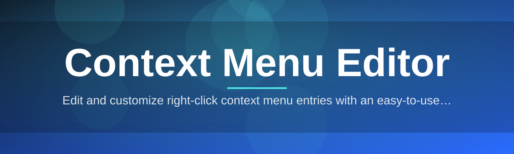

# context-menu-editor

Edit and customize right-click context menu entries with an easy-to-use graphical interface.

  

## Overview

Edit and customize right-click context menu entries with an easy-to-use graphical interface.

## License

[MIT License](LICENSE)
